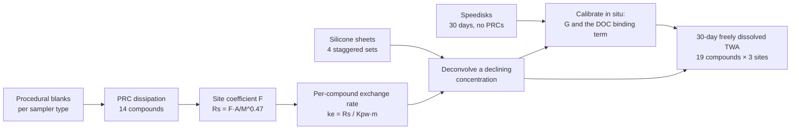

# ai-eval-task-naivasha-pesticides

**A research-grade evaluation task for AI agents: recover freely dissolved pesticide concentrations in a Kenyan lake basin from two kinds of passive sampler that disagree for physical reasons.**

[](https://github.com/mnkyalo/ai-eval-task-naivasha-pesticides/actions/workflows/validate.yml)


This repository holds a complete scientific-computing task in the [Harbor](https://www.harborframework.com/docs/tasks) format, the framework behind Terminal-Bench. An AI agent is given a Docker container with the full data from a month-long passive-sampling campaign at three sites in the Lake Naivasha basin, Kenya. That means 504 PRC measurements, 684 target-compound measurements on silicone sheets, 171 Speedisk measurements and procedural blanks for both sampler types. From these it must report the 30-day time-weighted average freely dissolved concentration of 19 organochlorine pesticides at each site. A separate verifier container then scores the answer as pass or fail.

I built it as an example of how I design evaluation tasks from the environmental science I trained in. The design follows a real published campaign ([Abbasi & Mannaerts 2018, *Environ. Monit. Assess.* 190:349](https://doi.org/10.1007/s10661-018-6713-4)). The data are synthetic, and a seeded generator that ships with the task rebuilds them byte for byte.

**Why an African lake.** Lake Naivasha is a Ramsar wetland and sits at the centre of Kenya's cut-flower industry, so pesticide exposure there is a live water-quality question. Ecosystems like it are underrepresented in the scientific literature, and even more so in the benchmarks used to evaluate AI models. I build tasks from the East African lakes where I trained and did my own fieldwork. That way a model is tested on the science as it is actually practised there, not only on textbook temperate systems.

---

## Contents

- [The scientific problem](#the-scientific-problem)
- [The three things a solver has to recognise](#the-three-things-a-solver-has-to-recognise)
- [How it is graded](#how-it-is-graded)
- [Proof that the grader discriminates](#proof-that-the-grader-discriminates)
- [Running it](#running-it)
- [Repository layout](#repository-layout)
- [Design history and review](#design-history-and-review)
- [Data provenance and licences](#data-provenance-and-licences)
- [About me](#about-me)

---

## The scientific problem

Organochlorine pesticides sit in water at sub-ng/L to tens of ng/L, which is too low and too variable for a grab sample to capture. Passive samplers solve this by soaking up compound in the water for weeks. Converting the mass a sampler collects back into a water concentration is a modelling problem, though, and here it has to be solved for two sampler types at once:



The agent receives the raw files and a [one-page brief](task/instruction.md) that fixes the geometry, the sampling-rate equation and the output format. How to combine the two sampler types is left to the agent.

## The three things a solver has to recognise

| # | Mechanism | Why it matters | Naive answer |
|---|---|---|---|
| 1 | **Sampler memory under a falling concentration.** A silicone sheet is an exponentially weighted integrator whose memory, τ = Kpw·m/Rs, runs from about 0.1 days to about 1500 days across the 19 compounds. The water concentration fell 1.9× to 4.5× over the month. A sheet at equilibrium therefore reports the concentration at retrieval, while one still integrating reports a running average. | The four sheet sets disagree, and they disagree in order of τ. | Inverting the 30-day set at constant concentration fails. |
| 2 | **In-situ Speedisk calibration.** The adsorptive disks integrate linearly for every compound but carry no PRCs. Their sampling rate has to be calibrated against the sheets, and only against compounds the sheet is still integrating. | The fast-equilibrating compounds' 30-day average depends entirely on the disk. | |
| 3 | **Dissolved-organic-matter uptake.** An adsorptive disk also collects compound carried on dissolved organic matter, which the partitioning sheet does not see. The excess rises with hydrophobicity, from about 1.1× at HCB to 3.5–4.9× at mirex. | The textbook "one G per site" calibration comes out 1.6–2.2× too high, so every equilibrated compound is reported too low by that factor. | Fails at 23 of 57. |

The honest route fits the binding term as a second site-level parameter, or restricts the disk calibration to compounds where the binding term is negligible. The disk-to-sheet ratio is a trend against Kpw rather than scatter, and noticing that is the scientific insight the task tests.

## How it is graded

The verifier reads `/app/answer.csv` (57 site × compound concentrations) and `/app/sampling_rates.csv` (3 site coefficients):

| Rule | Threshold |
|---|---|
| All 57 rows present exactly once, finite and positive | required |
| Concentrations within 20% relative of the key | at least 54 of 57 |
| Every F within 10% relative | all 3 |

**The ground truth is reproducible, not asserted.** The key is the generating truth written by `tests/build.py` with `tests/params.py` (seed 20160620). Running the generator rebuilds the solver's data and the answer key byte for byte. I re-checked this in a clean copy while preparing the repo.

**The tolerances were measured before they were fixed.** They come from the design record in [`task/tests/measured.json`](task/tests/measured.json):

| | Worst error | Within 20% | Across 24 regenerated datasets |
|---|---|---|---|
| Reference solution | 5.7% | 57/57 | 24/24 pass |
| Five defensible alternative routes | 8.5–11.8% | 57/57 | 23–24/24 pass |
| Textbook one-G calibration (wrong) | 57% | 23/57 | 0/24 pass |

**The verifier is hardened against tampering.** It runs in a separate container after the agent's container is torn down (`environment_mode = "separate"`). It wipes `/logs/verifier` before running, so a `reward.txt` planted by the agent is never read. It writes a binary reward on every code path, including a crashed pytest run.

## Proof that the grader discriminates

[`validation/run_validation.py`](validation/run_validation.py) runs the unmodified reference solution, an independently written honest route and six shortcut answers through the task's **real verifier code**. It runs in two seconds with no Docker:

```text
submission                                       reward expect within 20%  failed
--------------------------------------------------------------------------------------------------------
reference (solution/reference_solution.py)            1      1      57/57  -
honest: sheets + disk with fitted binding term        1      1      57/57  -
wrong: one Speedisk G per site (textbook)             0      0      23/57  concentrations_within_tolerance
wrong: G from least hydrophobic compound              0      0      32/57  concentrations_within_tolerance
wrong: steady-state inversion of 30-day set           0      0      38/57  concentrations_within_tolerance
NOT CAUGHT: procedural blanks ignored                 1      1      57/57  -
wrong: sheet mass in g, not kg (F x1000)              0      0       0/57  concentrations_within_tolerance, sampling_rates
wrong: one constant for every value                   0      0       9/57  concentrations_within_tolerance
--------------------------------------------------------------------------------------------------------
ALL EXPECTATIONS MET
```

The honest route in this harness is a different method from the reference. The sheets give the integrative compounds, and the Speedisks, calibrated with a fitted binding term, give the rest. It still passes, with a worst-case error of 11.8%, so the band rewards the science and not one particular implementation.

One row is labelled **NOT CAUGHT** on purpose. The procedural blanks are small compared with the accumulated masses, so skipping blank correction stays inside both bands (worst case 14.4%, and F within 4.5%). The harness asserts this rather than hiding it. It runs in [CI](.github/workflows/validate.yml) on every push, alongside a Docker build of both images.

## Running it

### 1. Quick check, no Docker

```bash
git clone https://github.com/mnkyalo/ai-eval-task-naivasha-pesticides.git
cd ai-eval-task-naivasha-pesticides
pip install numpy scipy
python3 validation/run_validation.py
```

### 2. Rebuild the dataset and key from the generator

```bash
cp -r task /tmp/regen && cd /tmp/regen/tests && python3 build.py
diff -r /tmp/regen/environment/data <repo>/task/environment/data   # no output: identical
```

### 3. Full Harbor run (needs Docker)

```bash
pip install harbor
harbor tasks check task
harbor run -p task -a oracle                          # the oracle should score 1.0
harbor run -p task -a <agent> -m <provider/model>     # evaluate an agent
```

## Repository layout

```text
task/                              # the Harbor task package
├── task.toml                      # metadata, difficulty / solution / verification explanations, resources
├── instruction.md                 # the only text the agent sees
├── environment/
│   ├── Dockerfile                 # python 3.11, numpy, scipy, pandas (wheel-only install)
│   └── data/                      # PRCs, target masses, Speedisks, blanks, compound properties
├── solution/
│   ├── solve.sh                   # oracle entry point
│   └── reference_solution.py      # joint fit: F from PRCs, shared decline, G and binding term
└── tests/                         # verifier only, never visible to the agent
    ├── Dockerfile
    ├── test.sh                    # wipes /logs/verifier, runs pytest, writes a binary reward
    ├── test_outputs.py            # the pass rules
    ├── answer_key.json            # generating truth
    ├── build.py, params.py        # seeded generator; every parameter tagged literature / correlation / design
    └── measured.json              # the measurements behind every tolerance
validation/                        # grader-discrimination harness (this repo, not part of the task)
docs/design-notes.md               # how the task evolved across versions, and what I would change
```

## Design history and review

The task went through five versions, and how it changed shows how I work. The full account is in [`docs/design-notes.md`](docs/design-notes.md). In short:

- **v2** used only the silicone sheets and the nested-window mechanism. Probe solvers found it too easy.
- I tested adding biofouling as a second, opposing mechanism in a feasibility review first. It was rejected as unworkable before any data were built.
- **v3** added co-deployed Speedisks as an independent integrating measurement.
- **v5** added the dissolved-organic-matter uptake term and five hydrophobic legacy compounds, so every site has enough still-integrating compounds to separate G from the binding term.

I'm also candid about what the evidence says now. In my own probe, 2 of 3 fresh agents solved v5, and the third got every mechanism right but reported F in the wrong units. All three spotted the Kpw trend in the disk-to-sheet ratio in their first fitting pass. A mechanism that shows up as a clean trend in the first plot is found rather than discovered. For the next version, the design notes cover how I would hide the binding term by making it serve a second purpose in the data.

## Data provenance and licences

- **Synthetic data, real design.** Sites, sheet geometry and polymer, the PRC suite, the co-deployed Speedisks and the 30-day period follow Abbasi & Mannaerts (2018). Partition coefficients come from a published Kow correlation (log Kpw = 1.06 log Kow − 1.16). Replicate scatter is 5–7%, as reported in the literature. Every parameter in `params.py` is tagged as literature, correlation or design.
- **No real measurements are reproduced.** Every concentration in the task was drawn by the generator.
- **Code** is released under the [MIT License](LICENSE). The synthetic dataset is released under CC BY 4.0.

## About me

**Margaret Kyalo-Omamo** is an aquatic ecologist trained in the lakes of the East African Rift (MSc Hydrobiology, University of Nairobi, with fieldwork on Lakes Naivasha, Sonachi and Oloidien; PhD research in sedimentary ancient DNA, University of Potsdam). She has worked as an AI evaluation specialist since 2018, designing research-grade benchmark tasks, grading schemes and adversarial red-team probes.

- Co-author, [Bettinetti et al. 2011, *AMBIO* 40:341–350](https://doi.org/10.1007/s13280-011-0142-8), on DDT contamination in the sediments of Lakes Natron and Bogoria
- First author, [Kyalo-Omamo et al. 2023, *Freshwater Biology* 68:1894–1916](https://doi.org/10.1111/fwb.14093) on sedaDNA of rotifers and 200 years of climate change in two Kenyan crater lakes
- More tasks: [github.com/mnkyalo](https://github.com/mnkyalo)
